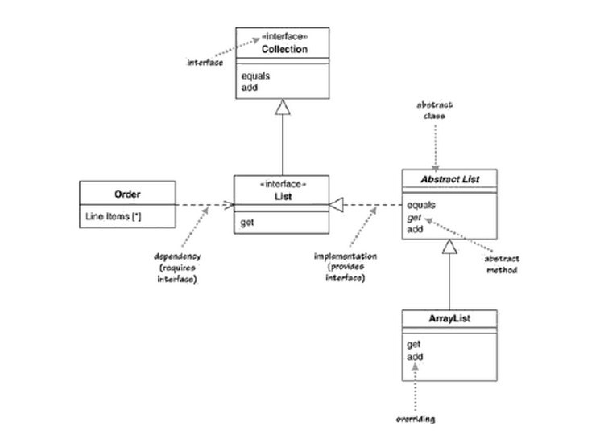

- [인터페이스와 API](#인터페이스와-api)
  - [의미](#의미)
  - [인터페이스(API)](#인터페이스api)
  - [인터페이스](#인터페이스)
- [패턴과 클래스의 역할](#패턴과-클래스의-역할)
  - [패턴](#패턴)
  - [클래스](#클래스)
  - [역할](#역할)
- [UML](#uml)
  - [클래스와 계층관계](#클래스와-계층관계)
  - [인터페이스와 구현](#인터페이스와-구현)
  - [집약(aggregation)](#집약aggregation)
  - [액세스 제어](#액세스-제어)
- [힌트](#힌트)
  - [목표](#목표)
  - [디자인 패턴은 클래스 라이브러리가 아니다](#디자인-패턴은-클래스-라이브러리가-아니다)
  - [클래스 라이브러리 안에서 디자인 패턴이 사용되고 있다](#클래스-라이브러리-안에서-디자인-패턴이-사용되고-있다)
  - [프로그램을 완성품으로 보지 않는다](#프로그램을-완성품으로-보지-않는다)
  - [다이어그램은 보는 것이 아니라 읽는 것](#다이어그램은-보는-것이-아니라-읽는-것)
  - [역할을 이해하자](#역할을-이해하자)

## 인터페이스와 API

### 의미

- `어떤 클래스의 인터페이스`: 클래스가 가지고 있는 메서드의 집합
- Java에서는 `inferface`를 사용해서 선언된 것

### 인터페이스(API)

- 일반적인 의미의 인터페이스(Application Programming Interface)

### 인터페이스

- `interface` 사용하해서 선언된 것

```java
interface AwesomeInterface {

}
```

## 패턴과 클래스의 역할

### 패턴

- 디자인 패턴을 의미

### 클래스

- `class` 키워드 사용해서 프로그램에서 정의된 것

```java
class Memento {
    // some fields and methods
}
```

### 역할

- 이 책 'Java 언어로 배우는 디자인 패턴 입문'에서만 사용하는 표현
- 디자인 패턴 속에 등장하는
  - 클래스
  - 인터페이스
  - 또는 인스턴스
- 디자인 패턴 속에서 특정한 역할을 수행하는 것

## UML

### 클래스와 계층관계



```java
class ChildClass extends ParentClass {

}
```

- `하위 클래스`(ChildClass) (extends)&#8594; `상위 클래스`(ParentClass)

  - `상위 클래스` = 기저 클래스 = 부모 클래스
  - `하위 클래스` = 파생 클래스 = 자식 클래 = 확장 클래스

- _`abstract` 클래스_
- _`abstract` 메서드_
- <u>`static` 필드</u>
- <u>`static` 메서드</u>

### 인터페이스와 구현

- `구현 클래스`(ChildClass) (implements))&#8594; `<<인터페이스>>`(ParentClass)

```java
class ConcreteClass implements SomeInterface {

}
```

### 집약(aggregation)

```java
Class Color {
    private String value;
}

Class Fruit {
    private Color color;
}

class Bascket {
    private List<Fruit> fruits;
}
```

- "갖고 있는" 관계를 `집약`이라고 한다
- 인스턴스를 갖고 있으면 개수에 상관없이 집약이라 한다

### 액세스 제어

| 기호 | 내용                        |
| ---- | --------------------------- |
| +    | public                      |
| -    | private                     |
| #    | protected                   |
| ~    | 동일 패키지 내에서만 액세스 |

## 힌트

### 목표

- 부품이 어떻게 조립되어야 큰 기능 발휘하는지 파악하여 적용
- 재이용 가능하게 만드는 것

### 디자인 패턴은 클래스 라이브러리가 아니다

- 클래스와 클래스 라이브러리가 부품이라면, 디자인 패턴은 **부품의 조립 방식과 어떻게 조립 되어야 큰 기능 발휘하는지**에 관한 것
- 어떤 종류의 클래스와 인터페이스가 존재하고 서로 어떤 **관계**인지를 설명하는 것이 중요

### 클래스 라이브러리 안에서 디자인 패턴이 사용되고 있다

- Iterator 패턴
  - `java.util.Iterator`는 여러 개를 나열해 갈 때 사용하는 인터페이스
- Observer 패턴
  - `java.util.Observer`는 오브젝트의 상태 변화를 관찰하는 인터페이스.
- Factory Method 패턴
  - `java.util.Calendar` 클래스의 `getInstance` 메서드
  - `java.security.SecureRandom` 클래스의 `getInstance` 메서드
  - `java.text.NumberFormat` 클래스의 `getInstance` 메서드
- Composite 패턴
  - `java.awt.Component`
  - `java.awt.Container`

### 프로그램을 완성품으로 보지 않는다

- 프로그램을 어떻게 **부품**으로 재이용할 수 있는지 생각해야 한다
  - **어떤 기능이 확장될 가능성이 있는가?**
  - **확장기능을 수행할 때 수정이 필요한 클래스는 무엇인가?**
  - **수정이 불필요한 클래스는 무엇인가?**

### 다이어그램은 보는 것이 아니라 읽는 것

### 역할을 이해하자

- 패턴마다 클래스나 인터페이스에 각자의 **역할**이 주어진다
- 각 클래스나 인터페이스의 역할을 이해하지 못하면, 전체 패턴을 이해할 수 없으며, 제대로 된 형식으로 만들 수 없다
